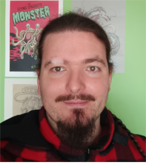

# Andreas  

*What is normal to the spider is chaos to the fly.*

## Me, in one sentence

|Question|My Answer|
|:--- |:--- |
|Birthday|15/05|
|Favorite color|Blue|
|Favorit food|Pizza|
|Pinneapple on pizza|It's a no from me|

## Hobbies
- Playing around with miniature wargames, this includes but is not limited by :
  - Assembling the minis;
  - Painting the minis;
  - Informing myself about the strengths and weaknesses of the minis;
  - Establishing graphs about how to best use the minis;
  - Playing the minis against my friends;
  - Repeating the process.
- Roleplaying and LARPing
- Board games
- Making jewelry
- Reading books
- Crafting

## You can always count on me when...
- Needing help in javascript : I'm not the best but I like the subject;
- Owning up to my mistakes;
- Needing explanations in general : I'm good at explaining subjects I'm familiar with, otherwise I'll tell you I don't know;
- Keeping the group in focus on the subject : I enjoy a good laugh but we're here to do a job.

## A funny story
Gather around and let me tell you the story of "Biquette" the goatman.
As I said above, I do LARP about once a year. In 2016, so a couple of years before the plague, I played as a goatman. Our camp was a mix of several fun-loving creatures, such as faeries, hobbits, dwarves etc...
I was part of the fighting group in the camp. One day we had a very big battle against undead invaders, we won by the skin of our teeth, I almost died several times. So, naturally, we were celebrated coming home, with a lot of mead and ale. What we didn't now was that we didn't defeat the necromancers who raised back the defeated undead and they attacked us at night after the celebrations. Needless to say, when the battlehorn sounded, I was not amused. It took me a little longer to wake so I had no time of putting on my armor, I just grabbed my furpants and ran out screaming... In german. You see german is my first language and in moments of intense anger I revert to it because it expresses my feelings better in this moment. This took our attackers by surprise, at this point my camp was used to me so the defenders weren't too surprised. So we pushed back the offensive and counter-attacked in the morning with the help of other camps. But this moment was etched in the memory of a lot of people until today.

### TL;DR
While larping were attacked by undead at 4a.m., undead got scared by screaming, giant hammer wielding, half-naked german goatman.

[<< Previous](https://www.google.com/)||ANDREAS||[Next>>](https://www.google.com/)